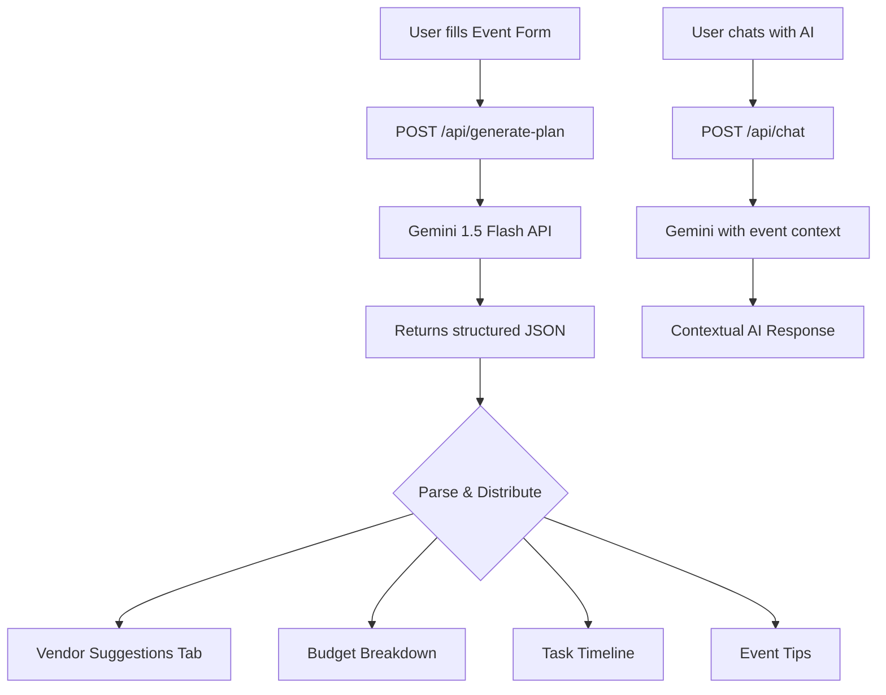

# 🎉 EventMind — AI-Powered Event Planning Platform

<div align="center">


**A full-stack, AI-powered event planning application that takes the stress out of organizing events — from budget planning to vendor discovery, attendee management, and real-time AI assistance.**

[🚀 Live Demo](#) • [📖 Documentation](#how-it-works) • [🛠️ Setup](#local-setup)

</div>

---

## ✨ Features

### 🧠 AI-Powered Planning
- **Gemini AI Integration** — Leverages Google's Gemini 1.5 Flash model to generate comprehensive event plans including vendor recommendations, budget breakdowns, timelines, and pro tips
- **Interactive AI Chat** — Real-time chat assistant with context awareness, message history, and smart suggestions powered by Gemini AI
- **Smart Vendor Tagging** — AI automatically categorizes and tags vendors based on their services and user reviews

### 📍 Live Vendor Discovery
- **Geoapify Places API** — Fetches real, local vendors near your event location (caterers, photographers, florists, entertainment, venues)
- **Dynamic Vendor Search** — Search and filter vendors by category with live geocoding and distance calculations
- **Vendor Profiles** — Detailed profiles with ratings, pricing, contact information, and direct booking capability
- **Booking System** — Book vendors directly within the app with status tracking

### 💰 Budget Management
- **Smart Budget Allocation** — AI suggests realistic budget splits across all event categories
- **Expense Tracker** — Track actual vs. planned spending with visual breakdowns
- **Per-Item & Per-Plate Pricing** — Supports both flat-rate and per-head vendor pricing models
- **Real-Time Budget Monitoring** — Live overview of remaining budget as you add vendors

### 📋 Event Planning Tools
- **Event Form** — Comprehensive event creation with type, date, location, guest count, and budget range
- **Task Timeline** — Auto-generated day-by-day countdown checklist with priority tracking (High/Medium/Low)
- **Attendee Management** — RSVP tracking, group management, and bulk attendee import
- **Email Invitations** — Send real email invitations and reminders via SMTP (Gmail integration)

### 📊 Analytics & Feedback
- **Analytics Dashboard** — Visual charts for budget utilization, attendance rate, vendor breakdown, and event scores
- **Post-Event Feedback** — Star ratings across multiple dimensions (food, decor, entertainment, venue, overall)
- **Feedback Summary** — Aggregated scores with AI-generated insights

---

## 🛠️ Tech Stack

| Layer | Technology | Purpose |
|-------|-----------|---------|
| **Frontend** | React 18 + Vite 5 | Fast, reactive UI with HMR |
| **Backend** | Node.js + Express 5 | REST API server |
| **AI Engine** | Google Gemini 1.5 Flash | Event planning & chat AI |
| **Vendor Data** | Geoapify Places API | Live local vendor discovery |
| **Email** | Nodemailer + Gmail SMTP | Real email invitations & reminders |
| **Styling** | Custom CSS (dark glassmorphism theme) | Premium dark-mode UI |
| **Data Storage** | File-based JSON store | Lightweight persistent storage |
| **Deployment** | Vercel (frontend) | Global CDN deployment |

---

## 📸 Screenshots

> The app features a stunning dark glassmorphism design with animated gradients and micro-interactions.

### Event Planning Dashboard
- AI-powered plan generation from a simple event form
- Tabbed navigation: Plan → Vendors → Timeline → Attendees → Feedback → Analytics

### Vendor Discovery
- Real vendors fetched from Geoapify based on your event location
- Filterable by category: Venue, Catering, Photography, Decoration, Entertainment

### AI Chat Assistant
- Context-aware conversation with your event details pre-loaded
- Smart reply suggestions and conversation history

---

## 🚀 Local Setup

### Prerequisites
- **Node.js** v18+ 
- **npm** v9+
- **Google Gemini API Key** — [Get free key](https://aistudio.google.com/app/apikey)
- **Geoapify API Key** — [Get free key](https://www.geoapify.com/)

### Installation

```bash
# 1. Clone the repository
git clone https://github.com/vanshgit1111/EVENT-PLANNER.git
cd EVENT-PLANNER

# 2. Install all dependencies
npm install

# 3. Configure environment variables
cp .env.example .env
# Edit .env and add your API keys (see below)

# 4. Start both frontend and backend concurrently
npm run dev
```

Frontend runs on: **http://localhost:5173**  
Backend API runs on: **http://localhost:5001**

### Environment Variables

Create a `.env` file in the root directory:

```env
# Required — AI Planning & Chat
GEMINI_API_KEY=your_gemini_api_key_here

# Required — Live Vendor Discovery
GEOAPIFY_API_KEY=your_geoapify_api_key_here

# Optional — Real Email Sending (Gmail)
SMTP_HOST=smtp.gmail.com
SMTP_PORT=587
SMTP_USER=your_gmail@gmail.com
SMTP_PASS=your_app_password_here
SMTP_FROM=your_gmail@gmail.com

# Optional — Google Places API (fallback vendor data)
GOOGLE_PLACES_API_KEY=

# Optional — Notion Cloud Backup
NOTION_TOKEN=
NOTION_DB_EVENTS=
NOTION_DB_VENDORS=
NOTION_DB_BOOKINGS=
NOTION_DB_FEEDBACK=
NOTION_DB_CHAT_LOGS=
```

> **📧 Gmail SMTP Setup**: Go to Google Account → Security → 2-Step Verification → App Passwords → Generate password for "Mail"

---

## 📁 Project Structure

```
EVENT-PLANNER/
├── 📄 index.html              # Root HTML entry point
├── 📄 vite.config.js          # Vite configuration with API proxy
├── 📄 package.json            # Dependencies & scripts
├── 📄 .env.example            # Environment variable template
├── 📄 start.sh                # Concurrent dev server launcher
│
├── 📁 src/                    # Frontend (React)
│   ├── App.jsx                # Main app with tab navigation
│   ├── App.css                # Global dark-theme styles
│   ├── api.js                 # Frontend API client utilities
│   ├── main.jsx               # React entry point
│   └── components/
│       ├── EventForm.jsx      # Event creation + AI plan trigger
│       ├── VendorBudget.jsx   # Vendor discovery + expense tracker
│       ├── VendorDashboard.jsx# Vendor overview & booking management
│       ├── VendorProfile.jsx  # Individual vendor detail view
│       ├── Timeline.jsx       # Task checklist + countdown timeline
│       ├── Attendees.jsx      # Attendee RSVP + email invitations
│       ├── Feedback.jsx       # Post-event feedback collection
│       ├── Analytics.jsx      # Dashboard with visual analytics
│       ├── Chat.jsx           # AI chat assistant interface
│       └── ErrorBoundary.jsx  # React error boundary wrapper
│
└── 📁 backend/                # Backend (Node.js + Express)
    ├── server.js              # Main Express API server (~2000+ lines)
    ├── store.js               # File-based persistent data store
    └── setup-notion.js        # Optional Notion database setup
```

---

## 🔌 API Endpoints

| Method | Endpoint | Description |
|--------|----------|-------------|
| `POST` | `/api/generate-plan` | Generate AI event plan with Gemini |
| `GET` | `/api/vendors` | Fetch live vendors from Geoapify |
| `GET` | `/api/vendors/list` | Get vendor list by location & category |
| `POST` | `/api/bookings` | Create a vendor booking |
| `GET` | `/api/bookings` | Get all bookings for an event |
| `POST` | `/api/send-email` | Send email invitations via SMTP |
| `POST` | `/api/chat` | AI chat message with Gemini |
| `POST` | `/api/feedback` | Submit post-event feedback |
| `GET` | `/api/feedback` | Get feedback for an event |
| `GET` | `/api/health` | Backend health check |

---

## 🤖 How the AI Works



1. **Event details** (type, date, location, guest count, budget) are submitted to the backend
2. **Backend constructs a detailed prompt** asking Gemini to generate a structured JSON plan
3. **Gemini 1.5 Flash** returns vendors by category, budget allocation, timeline tasks, and pro tips
4. **Frontend parses** the JSON and populates all tabs simultaneously
5. **Chat context** includes the generated plan, so the AI assistant has full event awareness

---

## 🗺️ Live Vendor Discovery Flow

```
User Location (city/address)
        ↓
   Geocoding API
        ↓
   Lat/Lon coordinates
        ↓
  Geoapify Places API
  (15km radius search)
        ↓
  Filter by categories:
  • activity.events_venue
  • catering.restaurant
  • service.photographer
  • commercial.florist
  • entertainment
        ↓
  Format & return to frontend
```

---

## 📬 Email System

The app uses **Nodemailer** with Gmail SMTP to send real emails:

- **Event Invitations** — HTML-formatted invitations with event details
- **RSVP Reminders** — Reminder emails for pending attendees
- **Booking Confirmations** — Vendor booking confirmation emails

To enable, configure `SMTP_*` variables in your `.env` file.

---

## 🚢 Deployment

### Deploy Frontend to Vercel

```bash
# Build the frontend
npm run build

# Deploy via Vercel CLI
npm i -g vercel
vercel --prod
```

Or connect your GitHub repo at [vercel.com](https://vercel.com):
1. Import the `EVENT-PLANNER` repository
2. Framework: **Vite** (auto-detected)
3. Add environment variables in Vercel dashboard
4. Click **Deploy**

> **Live URL**: [https://event-planner-vansh.vercel.app](https://event-planner-vansh.vercel.app) *(update after deployment)*

### Backend Deployment Options
- **Railway** — `railway up` (recommended for Express backends)
- **Render** — Free tier with auto-sleep
- **Heroku** — Classic Node.js hosting

> **Note**: Update `vite.config.js` proxy target to point to your deployed backend URL.

---

## 📈 Assignment / Project Rubric Coverage

| Module | Feature | Status |
|--------|---------|--------|
| **25%** — App Structure & Data Setup | Event form, budget templates, vendor categories, persistent store | ✅ Complete |
| **50%** — Timeline, Checklist & Budget | AI timeline, task checklist with priorities, expense tracker, attendee list | ✅ Complete |
| **75%** — AI Features & Automation | Gemini AI planning, AI chat assistant, smart vendor tagging, email automation | ✅ Complete |
| **100%** — Feedback & Analytics | Feedback form with star ratings, analytics dashboard with visual charts | ✅ Complete |

---

## 🤝 Contributing

1. Fork the repository
2. Create a feature branch: `git checkout -b feature/amazing-feature`
3. Commit your changes: `git commit -m 'Add amazing feature'`
4. Push to the branch: `git push origin feature/amazing-feature`
5. Open a Pull Request

---

## 📄 License

This project is licensed under the **MIT License** — see the [LICENSE](LICENSE) file for details.

---

## 👤 Author

**Vansh Chaturvedi**  
GitHub: [@vanshgit1111](https://github.com/vanshgit1111)

---

<div align="center">

Made with ❤️ and powered by **Google Gemini AI** & **Geoapify**

⭐ Star this repo if you found it helpful!

</div>
